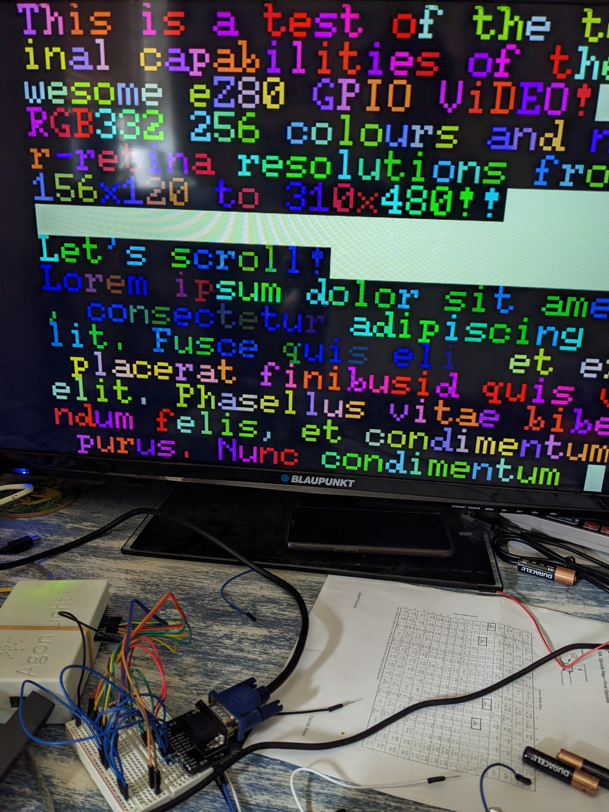
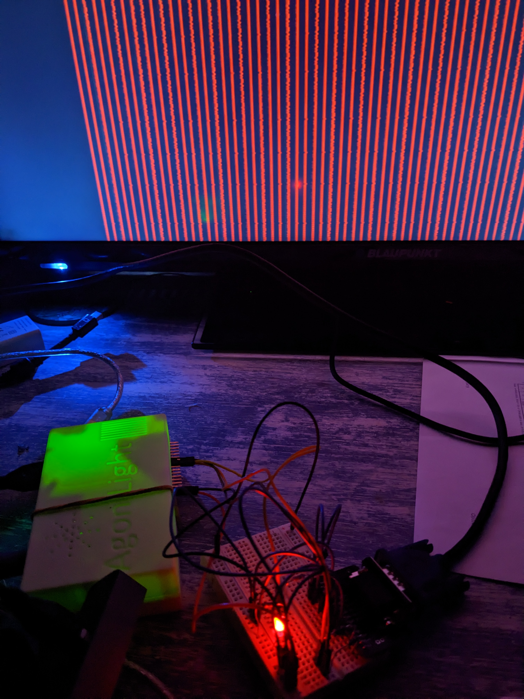
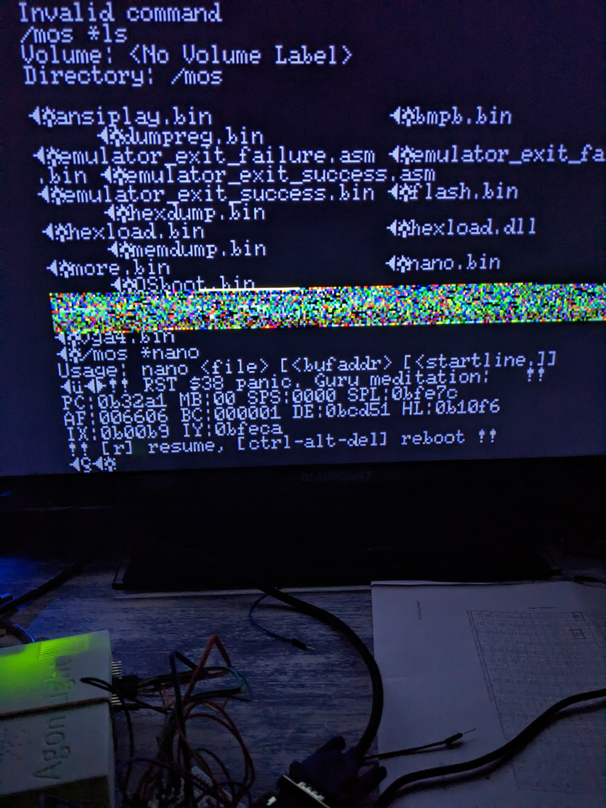
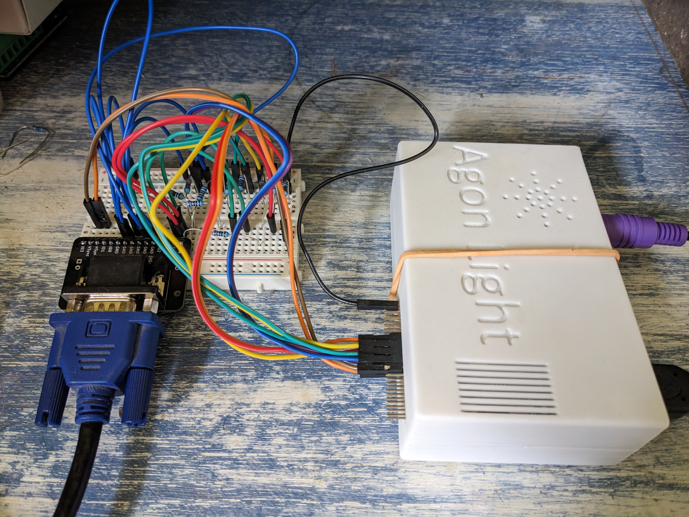

# VGA-EZ80: An experiment in eZ80 video signal generation

Check out this video of [60fps framebuffer scrolling](https://www.youtube.com/shorts/ev4wi_WDekA),
all done by the eZ80 CPU.



## What is this?

This was an experimental framebuffer video driver for the Agon
Light. The goal was to have 8-bit (256 colour RGB332) VGA output
directly from the main CPU (eZ80F92), as a more fun alternative
to the serial link display protocol of the VDP (esp32). This would
let programmers just draw pixels to ez80 memory, indulge in
cycle-counting optimisations, horizontal sync effects (like framebuffer
offsets per scanline for wibble-wobble effects), etc.

## How's that going to work?

It all hinges on the eZ80 `otirx` instruction, which is a bit
like `ldir` except that the output goes to a fixed IO port rather
than to another memory location. `otirx` takes 3 cycles per byte.
If you use a GPIO IO port, that means you can scan out 8-bit pixels
at CPU clock / 3. On Agon Light that means 18.432Hz / 3 = 6.14MHz
pixel clock.

That's a pretty low pixel clock for VGA timings. Sticking to standard 60Hz 640x480,
a 6.14MHz pixel clock gives you around 156 pixels per scanline. So
you get a super-wonky resolution of 156x480. In practice I implemented
double, triple, and quad-scanning. So more useful resolutions of
156x240, 156x160 and 156x120 were achieved. I also experimented with
15khz timings, which one of my monitors accepted. That gave 310 pixel
wide modes. Very nice.

## Timings

To follow VGA 64x480x60Hz timings, we have the following clock cycle
budget per scanline on the eZ80:

```
Total scanline:    586 cycles (31.792 us)
    hsync pulse:    71 cycles
    front porch:    35 cycles
    pixel data:    468 cycles
    back porch      12 cycles
```

## What about the wiring to a VGA port?

I used the following GPIOS:
GPIO D pin 7: hsync
GPIO D pin 6: vsync
GPIO C pin 0-7: pixel data (RGB332)

Hsync and vsync connected straight to VGA. Colour signals involved
resistor ladders with values around 544, 1.2k, 2.4k ohm for red and
green, and 455, 986 ohm for blue.

## Did it work?

### No Interrupts

See [ideal31khz.asm](ideal31khz.asm).

Kinda. The eZ80F92 has no DMA capabilities, so you need to hog the
CPU to do video scanout. I had 2 prototypes: one that simply ran in
a loop, using 100% CPU, to achieve ideal timing (within 0.04% of VGA
timings). Both my monitors could sync to this. Unfortunately you
can't run application code alongside this, so...

### With Interrupts

See [gpiovideo.asm](gpiovideo.asm) and [31khz.asm](31khz.asm).

The other prototype was interrupt-based. It used eZ80F92 PRT timers
to interrupt user code in order to output the sync signal, while 
the picture section of the scanout had to be done at 100% CPU since
there was no time left between sync and picture to really yield
to an application. This left less than 8% CPU for the user programs,
but that might still be more grunt than a 4MHz Z80 of bygone times.

In short, only one of my monitors (a very permissive Blaupunkt TV/Monitor)
would sync to this signal. This is because eZ80 interrupt service time
depends on the duration of the active instruction, which can be anything 
between 1 and 7 (?) cycles. This was simply too much jitter for my
other monitor.

I couldn't imagine any solution to this whatsoever, so that's where
the experiment ended.

## Further avenues to explore

### Optimisation

The routines are not fully optimised, since foundational issues were still 
being worked on when the fundamental jitter issue was realised. A notable place for
optimisation would be return from hsync on blank lines. This could be done
much sooner after the de-assertion of hsync, giving back more cycles to
application code.

### More free CPU with 640x350

Before realising the whole scheme was a bust, I had been planning to adopt
VGA standard 640x350 timings. These would have given the application code
more CPU time, since there are more blank scanlines in this resolution (22%).

### A nuclear option

If the eZ80 can't produce a jitter-free sync, an alternative would be to
piggy-back on the sync signals produced by the ESP32. Providing those to
the monitor, with the colour signal coming from the EZ80 GPIO-C, you'd 
certainly get reliable sync. However, the EZ80 would still need to sync 
to the ESP32's vsync via GPIO interrupts, so you would get an overall 
picture position jitter which would probably be completely intolerable.
This is why I never actually explored implementing this.

## The project in images

Here we have the first Eureka! An image on screen!


Scanning out some real framebuffer data (actually it's the MOS ROM :) )


The resistor ladder is fully populated now. Here's all 256 colours:


Some text drawing routines in 256 colours:


Experiments in framebuffer-enabled MOS. Some programs don't like the framebuffer
sitting in RAM they expect to be free, hence the screen corruption and
crash dump :)


The completed wiring. My highschool electronics knowledge was enough to
avoid burning out the Agon.

